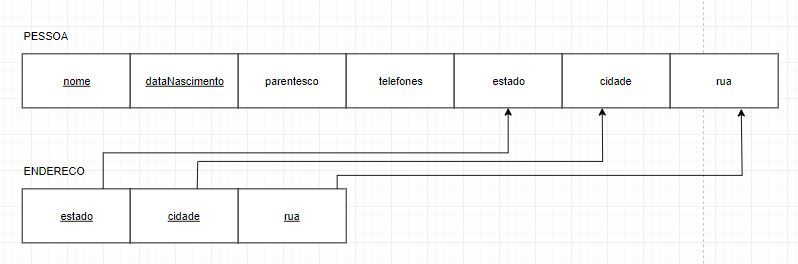

# Modelo Entidade-Relacionamento

## Entidades

- PESSOA((nome, dataNascimento), parentesco, telefones,(estado, cidadae, rua))
- ENDERECO((estado, cidadae, rua))

## Relacionamentos

- PESSOA- possui - ENDERECO

    Uma PESSOA pode possuir vários ENDERECOs, e um ENDERECO pode pertencer a várias PESSOAs.
    
    **Cardinalidade**: n:m

## Diagrama Entidade-Relacionamento

## Diagrama de Esquemas

