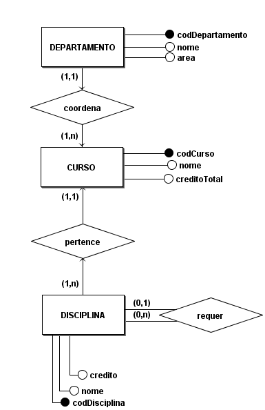

# Aula 4 Extra 1

## MER

### Entidades
<u></u>
- Departamento(<u>codDepartamento</u>, nome, area)
- Curso(<u>codCurso</u>, nome, creditoTotal)
- Disciplina(<u>codDisciplina</u>, nome, credito)

### Relacionamentos

- DEPARTAMENTO - coordena - CURSO

    Um DEPARTAMENTO coordena um ou vários CURSOs e um CURSO é coordenado por um DEPARTAMENTO.
 
    **Cardinalidade:** 1:n

- CURSO - pertence - DISCIPLINA

    Um CURSO pertence uma ou várias DISCIPLINAs e uma DISCIPLINA é pertencente a um CURSO.

    **Cardinalidade:** 1:n

- DISCIPLINA - requer - DISCIPLINA

    Uma DISCIPLINA requer uma ou várias DISCIPLINAs e uma DISCIPLINA é requerida por uma ou várias DISCIPLINAs.

    **Cardinalidade:** n:m

## DER

## Logico
