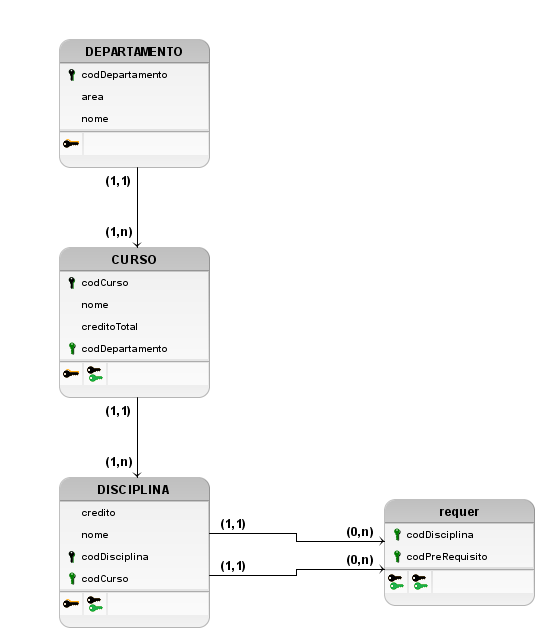

# Aula 4 Extra 1

## MER

### Entidades
<u></u>
- Departamento(<u>codDepartamento</u>, nome, area)
- Curso(<u>codCurso</u>, nome, creditoTotal)
- Disciplina(<u>codDisciplina</u>, nome, credito)

### Relacionamentos

- DEPARTAMENTO - coordena - CURSO

    Um DEPARTAMENTO coordena um ou vários CURSOs e um CURSO é coordenado por um DEPARTAMENTO.
 
    **Cardinalidade:** 1:n

- CURSO - pertence - DISCIPLINA

    Um CURSO pertence uma ou várias DISCIPLINAs e uma DISCIPLINA é pertencente a um CURSO.

    **Cardinalidade:** 1:n

- DISCIPLINA - requer - DISCIPLINA

    Uma DISCIPLINA requer uma ou várias DISCIPLINAs e uma DISCIPLINA é requerida por uma ou várias DISCIPLINAs.

    **Cardinalidade:** n:m

## DER

## Logico

## Dicionario de dados

| Entidade: DEPARTAMENTO |
|---|
| Descrição: Define os dados da entidade DEPARTAMENTO que será cadastrada no sistema. |

| Atributo | Propriedades do atributo |Propriedades do atributo | Tipo de dado | Descrição |
| --- | --- | --- | --- | --- |
| codDepartamento | Chave primária; Obrigatório; | INT | 8 | Identificador do Departamento |
| nome | Obrigatório; | VARCHAR | 50 | Nome do Departamento |
| area | Obrigatório; | VARCHAR | 50 | Area em que o departamento atua |

| Entidade: CURSO |
|---|
| Descrição: Define os dados da entidade CURSO que será cadastrada no sistema. |

| Atributo | Propriedades do atributo |Propriedades do atributo | Tipo de dado | Descrição |
| --- | --- | --- | --- | --- |
| codCurso | Chave primária; Obrigatório; | INT | 8 | Identificador do Curso. |
| nome | Obrigatório; | VARCHAR | 50 | Nome do Curso |
| creditoTotal | Obrigatório; | INT | 3 | Quantidade total de créditos do curso |
| codDepartamento | Chave Estrangeira; | INT | 8 | Identificador do Departamento do Curso |

| Entidade: DISCIPLINA |
|---|
| Descrição: Define os dados da entidade DISCIPLINA que será cadastrada no sistema. |

| Atributo | Propriedades do atributo |Propriedades do atributo | Tipo de dado | Descrição |
| --- | --- | --- | --- | --- |
| codDisciplina | Chave primária; Obrigatório; | INT | 8 | Identificador da Disciplina |
| nome | Obrigatório; | VARCHAR | 50 | Nome da Disciplina |
| credito | Obrigatório; | INT | 3 | Quantidade de créditos da disciplina. |
| codCurso | Chave estrangeira; Obrigatório; | INT | 8 | Identificador do Curso em que a Disciplina está relacionada. |

| Relacionamento: requer |
|---|
| Descrição: Define o auto-relacionamento entre DISCIPLINA e DISCIPLINA |

| Atributo | Propriedades do atributo |Propriedades do atributo | Tipo de dado | Descrição |
| --- | --- | --- | --- | --- |
| codDisciplina | Chave primária; Chave Estrangeira; Obrigatório; | INT | 8 | Identificador da disciplina |
| codPreRequisito | Chave primária; Chave Estrangeira; Obrigatório; | INT | 8 | Identificador da disciplina Pre Requisito |