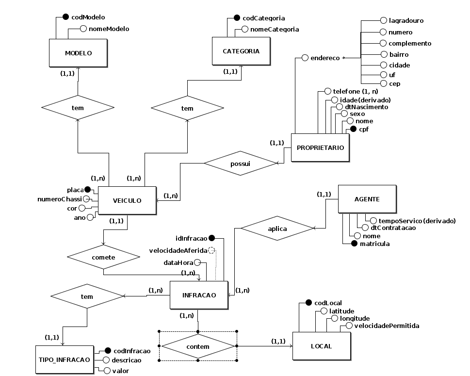
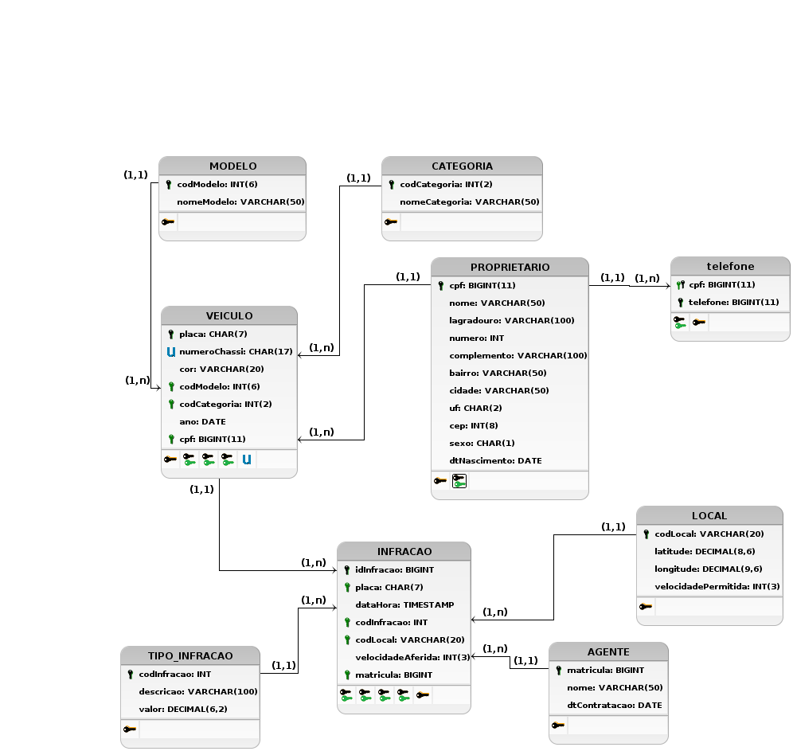

# Modelo Entidade-Relacionamento

## Entidades

- PROPRIETARIO (<u>cpf</u>, nome, (lagradouro, numero, cidade, bairro, estado,complemento, cep), {telefone}, sexo, dtNascimento, idade)
- MODELO (<u>codModelo</u>, nomeModelo)
- CATEGORIA (<u>codCategoria</u>, nomeCategoria)
- VEICULO (<u>placa</u>, numeroChassi, cor, codModelo, codCategoria, ano, cpf)
- LOCAL (<u>codLocal</u>, latitude, longitude, velocidadePermitida)
- AGENTE (<u>matricula</u>, nome, dtContratacao, tempoServico)
- TIPO_INFRACAO (<u>codInfracao</u>, descricao, valor)
- INFRACAO (<u>idInfracao</u>, placa, dataHora, codInfracao, codLocal, velocidadeAferida, matricula)

## Relacionamentos

- PROPRIETARIO – possui – VEICULO
    Um PROPRIETARIO possui um ou mais veículos e um VEICULO é de apenas um proprietário.

    **Cardinalidade**: 1:n

- VEICULO – tem – MODELO

    Um VEICULO tem um modelo e um MODELO pode ser de um ou vários veículos.

    **Cardinalidade**: n:1

- VEICULO – tem – CATEGORIA

    Um VEICULO tem uma categoria e uma CATEGORIA pode ser de um ou vários veículos.

    **Cardinalidade**: n:1

- VEICULO – comete – INFRACAO
    Um VEICULO comete uma ou mais infração e uma INFRACAO é cometida por um veículo.  

    **Cardinalidade**: 1:n

- INFRACAO – tem – TIPO_INFRACAO
    Uma INFRACAO tem um tipo de infração e um TIPO_INFRACAO pode ser de uma ou várias infrações.

    **Cardinalidade**: n:1

- INFRACAO – contem – LOCAL
    Uma INFRACAO contem um local e um LOCAL pode ser de uma ou várias infrações.

    **Cardinalidade**: n:1
    
- AGENTE – aplica – INFRACAO
    Um AGENTE aplica uma ou várias infrções e uma INFRACAO é aplicada por um agente.

    **Cardinalidade**: 1:n

## Diagrama Entidade-Relacionamento

## Diagrama Lógico

