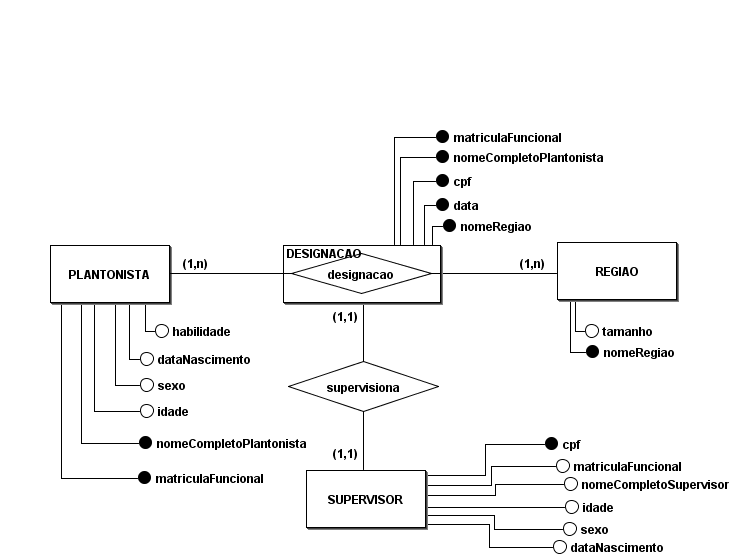
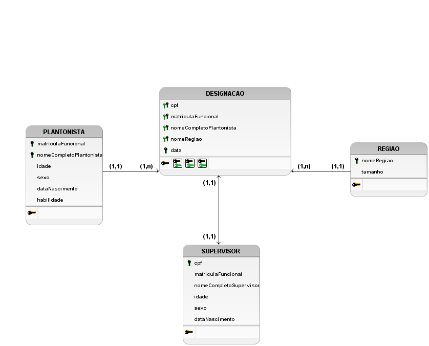

# Revisão P1

## Questão

    A secretaria de segurança do DF lhe contratou para resolver o problema das escalas de plantonistas vinculados a segurança das pessoas (povo) no GDF. O DF é formado por várias regiões (ou cidades), possuindo cada uma delas um nome específico e um tamanho em quilômetros quadrados (nunca menor que 10). O plantonista é alocado em uma data específica para uma região de cobertura durante 24 horas e após isso ele é trocado. Seu cadastro é efetuado por nome completo, matrícula funcional, idade, sexo (Masculino ou Feminino) e data de nascimento, sendo relevantes tais dados para sua melhor identificação e atribuições. Cada plantonista ainda possui ao menos uma habilidade em que foi formado em segurança. Todo plantonista só possui um supervisor na área de segurança e identificado por seu CPF. O supervisor não tem nenhuma habilidade, mas tem os mesmos dados cadastrais do plantonista (nome completo, matrícula funcional, idade, sexo e data de nascimento). Um plantonista pode estar alocado para mais de uma região, mas não na mesma data. Cada região pode ter vários plantonistas alocados em uma mesma data, independentemente de suas habilidades.

    Faça o ME-R, DE-R e o Diagrama Lógico (DL) que atenderá essa necessidade, além dos scripts de implementação física relativas as exigências para a implementação completa do projeto de banco de dados (arquivos respeitando o padrão indicado pela expressão Fisico, Popula com ao menos 3 tuplas por tabela existente no projeto e Apaga, que apagará uma tabela por vez, sem apagar a base de dados denominada bdPlantao).

## Modelo Entidade-Relacionamento

### Entidades
<u></u>
- SUPERVISOR(<u>cpf</u>, matriculaFuncional, nomeCompletoSupervisor, idade, sexo, dataNascimento)
- PLANTONISTA((<u>matriculaFuncional</u>, <u>nomeCompletoPlantonista</u>), idade, sexo, dataNascimento, habilidade, cpf)
- REGIAO(<u>nomeRegiao</u>, tamanho)
- DESIGNACAO(<u>matriculaFuncional</u>, <u>nomeCompletoPlantonista</u>, <u>cpf</u> data)

### Relacionamentos

- PLANTONISTA - designacao - REGIAO

    Um PLANTONISTA é designado para uma ou mais REGIAO e uma REGIAO é designada para um ou mais PLANTONISTAS.
    
    Cardinalidade: n : m

- SUPERVISOR - supervisiona - DESIGNACAO

    Um SUPERVISOR supervisiona uma DESIGNACAO e uma DESIGNACAO é supervisionada por um SUPERVISOR.

    Cardinalidade: 1:1

## Diagrama Entidade-Relacionamento

## Diagrama Lógico

