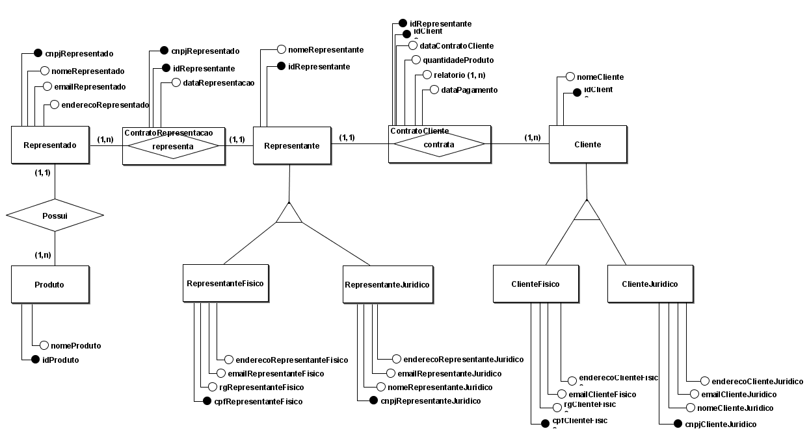
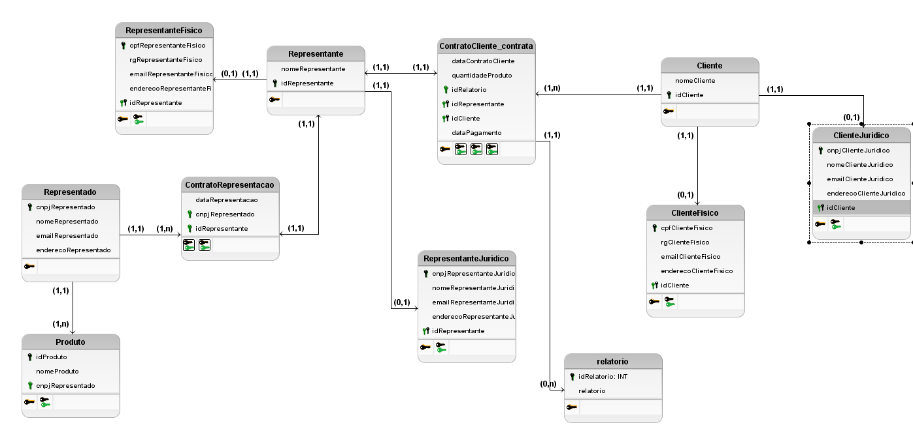

# Modelo Entidade Relacionamento

## Entidades
<u></u>
- Produto(<u>idProduto</u>, nomeProduto, cnpjRepresentado)
- Representada(<u>cnpjRepresentado</u>, nomeRepresentado, emailRepresentado, enderecoRepresentado)
- ContratoRepresentacao(<u>cnpjRepresentado, idRepresentante</u>,dataRepresentacao)
- Representante(<u>idRepresentante</u>, nomeRepresentante)
    
    - RepresentanteFisico(<u>cpfRepresentanteFisico</u>,rgRepresentanteFisico, emailRepresentanteFisico, enderecoRepresentanteFisico)
    - RepresemtamteJuridico(<u>cnpjRepresentanteJuridico</u>, nomeRepresentanteJuridico, emailRepresentanteJuridico, enderecoRepresentanteJuridico)

- ContratoCliente(<u>idRepresentante, idCliente</u>, dataContratoCliente, quantidadeProduto, {relatorio}, dataPagamento)
- Cliente(<u>idCLiente</u>, nomeCliente)

    - ClienteFisico(<u>cpfClienteFisico</u>, rgClienteFisico, emailClienteFisico, enderecoClienteFisico)
    - ClienteJuridico(<u>cnpjClienteJuridico</u>, nomeClienteJuridico, emailClienteJuridico, enderecoClienteJuridico)

## Relacionamentos

- REPRESENTADO - possui - PRODUTO
    
    Um REPRESENTADO possui um ou vários PRODUTOS e um PRODUTO pertence a um REPRESENTADO.

    **Cardninalidade:** 1:n

- REPRESENTANTE - representa - REPRESENTADO
    
    Um REPRESENTANTE representa um ou vários REPRESENTADOs e um REPRESENTADO é representado por um REPRESENTANTE.

    **Cardninalidade:** 1:n

- CLIENTE - contrata - REPRESENTANTE
    
    Um ou vários CLIENTES contrata(m) um REPRESENTANTE e um REPRESENTANTE é contratado por um CLIENTE.

    **Cardninalidade:** n:1

# Diagrama Entidade Relacionamento

# Diagrama Lógico
